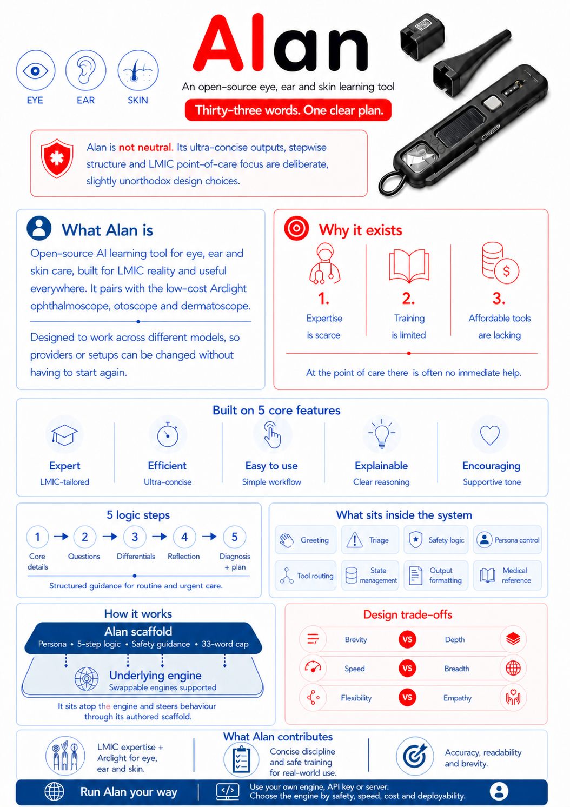

# Alan

Alan is an open-source eye, ear and skin learning prompt for concise point-of-care guidance.

It is designed for health workers, trainers and researchers who need a portable prompt that can run across different LLM providers, APIs or local model servers. Alan is especially shaped around LMIC practice: scarce specialist support, low-cost tools, brief outputs and clear referral safety.



## Use The Prompt

Use [`alan_compiled.txt`](alan_compiled.txt) as the ready-to-run system prompt.

The compiled file is generated from [`alan_sm.md`](alan_sm.md) by stripping maintainer comments while preserving the prompt structure. Alan Probe and API model runs should use `alan_compiled.txt` unless you deliberately provide another prompt file.

```powershell
python compile.py
```

## What Alan Is

- A concise learning prompt for eye, ear and skin cases.
- A structured scaffold for triage, focused questions, differentials, reflection and a diagnosis plus plan.
- A model-agnostic prompt intended to work with hosted APIs, local engines or provider-specific deployments.
- A practical companion for low-cost tools such as the Arclight ophthalmoscope, otoscope and dermatoscope.

## What Alan Is Not

Alan is not a medical device, diagnostic service or replacement for local clinical judgement. It does not provide emergency services. It is a learning and support prompt whose outputs must be checked by a responsible health worker using local protocols.

No institutional endorsement by the University of St Andrews is implied.

## Repository Guide

- [`alan_sm.md`](alan_sm.md): canonical human-editable source prompt.
- [`alan_compiled.txt`](alan_compiled.txt): ready-to-use prompt text.
- [`Alan_DSL`](Alan_DSL): DSL-wrapped source with stable IDs, TAGs and GROUPs.
- [`Alan_dsl_complied.txt`](Alan_dsl_complied.txt): compiled output from the DSL source. The spelling is retained intentionally.
- [`DSL.md`](DSL.md): DSL v13 specification and workflow notes.
- [`compile.py`](compile.py): legacy compiler from `alan_sm.md`.
- [`compile_DSL.py`](compile_DSL.py): primary DSL compiler for active workflow.
- [`export_prompt.py`](export_prompt.py): optional exporter for paste-ready prompt files.
- [`ablation_ui.py`](ablation_ui.py): optional local UI for GROUP-based ablation experiments.
- [`ALAN_EXPRESSIONS.md`](ALAN_EXPRESSIONS.md): expression syntax for ablation GROUP filters.
- [`BACKGROUND.md`](BACKGROUND.md): project background, design choices and intended use.
- [`report.txt`](report.txt): latest local validation report.

## Validate

Run the compiler checks before publishing prompt edits:

```powershell
python compile_DSL.py
python compile.py
python -m unittest tests.test_compilers
```

Expected invariants:

- `Alan_DSL` stripped of wrappers matches `alan_sm.md`.
- DSL wrappers have unique stable IDs.
- No deprecated `EXS-*` IDs are present.
- `compile_DSL.py` and `compile.py` produce matching prompt text when no group filter is used.

## Licence

Alan uses a split licence:

- Prompt, DSL source, documentation and visual assets: [CC BY-SA 4.0](https://creativecommons.org/licenses/by-sa/4.0/).
- Python code and tests: MIT.

See [`LICENSE.md`](LICENSE.md).
