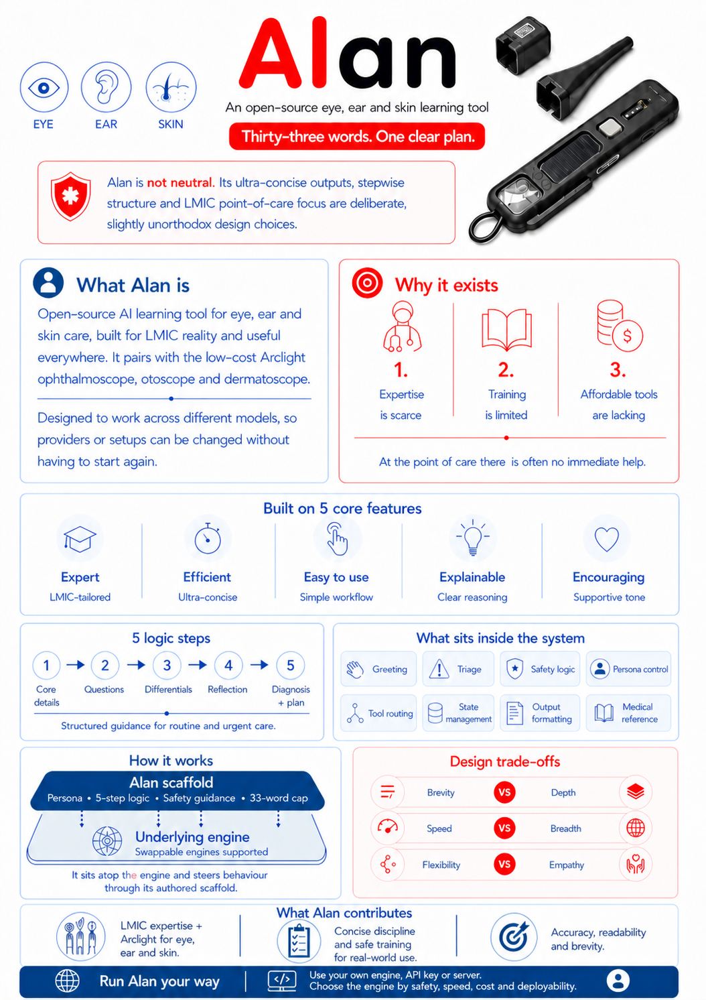

# Alan

[](https://github.com/Spider201866/alan/actions/workflows/validate.yml)

*Thirty-three words. One clear plan.*

Alan is an open-source scaffold for creating a concise eye, ear and skin teaching agent atop a language model. The model provides the engine; Alan supplies the authored layer: persona, curated memory, safety logic, a five-step learning workflow and strict output discipline.

Designed for teaching and supervised case-based learning, Alan is neither a diagnostic product nor a medical or emergency service. Differentials, provisional diagnoses and plans appear only within a learning sequence; Alan has not been validated to diagnose patients independently or direct treatment.

The design begins with constraints common in low- and middle-income country (LMIC) settings: limited specialist access, affordable examination tools, short consultations and the need for one clear next teaching step. The same disciplined approach can support brief, structured clinical teaching anywhere.

The narrow brief is matched by a distinctive voice. Alan is not a general medical chatbot, but a clinical intelligence: formally polite, exacting, unsentimental and faintly eccentric. Terse, steady and dryly confident, he has a taste for order and small oddities: a useful presence with manners, memory and purpose.



## Use Alan

[`alan_compiled.txt`](alan_compiled.txt) is the ready-to-use scaffold. Load the file as a system or instruction prompt.

```powershell
git clone https://github.com/Spider201866/alan.git
cd alan
```

```python
from pathlib import Path

alan_scaffold = Path("alan_compiled.txt").read_text(encoding="utf-8")
case = "Adult with red painful eye and reduced vision."

# Send alan_scaffold as the system or instruction prompt.
# Send case as the user message.
```

In a chat interface, place the compiled scaffold in the system or instruction field, then enter a fictional or properly de-identified teaching case. For an API or local model server, send the scaffold as the system message and the case as the user message.

Authored as text, Alan can run through hosted APIs, on local hardware or on private servers. The scaffold remains portable, editable and forkable for local teaching, research or implementation. See [`QUICKSTART.md`](QUICKSTART.md) for editing, compiling and export workflows.

Portability does not mean identical behaviour. Every deployment inherits the capabilities and limitations of its underlying model. Stronger models may improve fluency and clinical reasoning, but performance still varies with model choice, quantisation and settings. Local testing remains essential.

## What Alan Does as a Learning Tool

Alan turns the underlying model into a learning tool that:

- Maintains a consistent teaching persona across a case discussion.
- Structures eye, ear and skin cases into five stages: core details, focused questions, differentials, reflection and a provisional diagnosis and plan.
- Pauses the ordinary flow when red flags demand urgent escalation or an unsafe action must be stopped.
- Draws on curated examples and compact in-context memory to demonstrate reasoning, retain relevant details and preserve Alan's character.
- Connects discussion to findings from accessible tools such as the Arclight ophthalmoscope, otoscope and dermatoscope.
- Keeps responses brief, plain and structured for teaching in time-limited settings.

The sequence supports teaching rather than automated diagnosis.

## Limits and Safety

Alan cannot examine a patient, verify submitted information, authorise treatment or provide emergency care. Every differential, provisional diagnosis and plan forms part of a teaching sequence and requires checking against examination findings, local guidance and senior clinical judgement.

Use fictional or properly de-identified cases unless the deployment has explicit approval for handling patient-identifiable information. Do not send identifiable clinical information to a hosted model without appropriate information-governance approval.

Read [`SAFETY.md`](SAFETY.md) before using Alan in teaching, research or deployment.

No institutional endorsement by the University of St Andrews is implied.

## Start Here

- [`alan_compiled.txt`](alan_compiled.txt): ready-to-use Alan scaffold.
- [`alan_sm.md`](alan_sm.md): canonical human-editable source prompt.
- [`QUICKSTART.md`](QUICKSTART.md): use, editing, compiling and export instructions.
- [`BACKGROUND.md`](BACKGROUND.md): origins, architecture, character and design principles.
- [`SAFETY.md`](SAFETY.md): intended use, safety status and deployment cautions.

## For Maintainers

[`Alan_DSL`](Alan_DSL) wraps the canonical prompt with stable IDs, TAGs and GROUPs for traceable editing and ablation. [`compile_DSL.py`](compile_DSL.py) is the primary compiler. [`compile.py`](compile.py) is retained as the legacy compiler. See [`DSL.md`](DSL.md) and [`CONTRIBUTING.md`](CONTRIBUTING.md) before changing prompt content.

Run these checks before publishing prompt edits:

```powershell
python validate.py
python -m unittest tests.test_compilers
```

Validation checks source parity, DSL wrapper integrity, stable IDs, deprecated IDs and matching compiled outputs. GitHub Actions runs the same validation on pushes and pull requests.

## Licence and Citation

Alan uses a split licence:

- Prompt, DSL source, documentation and visual assets: [CC BY-SA 4.0](https://creativecommons.org/licenses/by-sa/4.0/).
- Python code and tests: MIT.

See [`LICENSE.md`](LICENSE.md) and [`CITATION.cff`](CITATION.cff).
