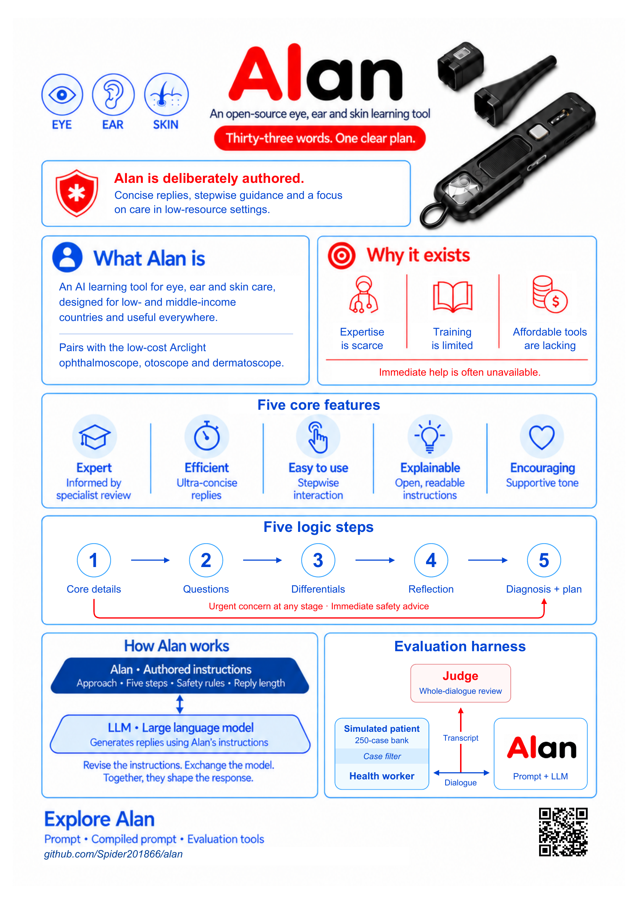

# Alan

[](https://github.com/Spider201866/alan/actions/workflows/validate.yml)

*Thirty-three words. One clear plan.*

**v0.2.0 · README updated 4 October 2026**

Originally created 6 June 2023.

Alan is an open-source scaffold for concise eye, ear and skin teaching with a language model. The model generates replies; Alan supplies the authored layer: persona, curated memory, safety logic, a five-step learning workflow and a concise response format.

Designed for health workers, students and clinical teachers, Alan supports case-based learning and structured clinical reasoning.

The design begins with constraints common in low- and middle-income country (LMIC) settings: limited specialist access, affordable examination tools, short consultations and the need for one clear next teaching step. The same disciplined approach can support brief, structured clinical teaching anywhere.

The narrow brief is matched by a distinctive voice. Alan is a clinical intelligence: formally polite, exacting, unsentimental and faintly eccentric. Terse, steady and dryly confident, he has a taste for order and small oddities: a useful presence with manners, memory and purpose.

[](assets/Alan-poster-A3-authored.pdf)

[View or download the A3 poster (PDF)](assets/Alan-poster-A3-authored.pdf).

## Use Alan

[`alan_compiled.txt`](alan_compiled.txt) is the ready-to-use scaffold for chat interfaces, APIs and local model servers. Load it as the system or instruction prompt and supply a fictional or properly de-identified teaching case as the user message.

```powershell
git clone https://github.com/Spider201866/alan.git
cd alan
```

Prompt-loading example for Python:

```python
from pathlib import Path

alan_scaffold = Path("alan_compiled.txt").read_text(encoding="utf-8")
case = "Adult with red painful eye and reduced vision."

# Send alan_scaffold as the system or instruction prompt.
# Send case as the user message.
```

Start each new case in a fresh conversation with the full compiled prompt. Keep the dialogue history within that case, but do not carry previous patients' conversations into the next one.

Authored as text, Alan can run through hosted APIs, on local hardware or on private servers. The scaffold remains portable, editable and forkable for local teaching, research or implementation. See [`QUICKSTART.md`](QUICKSTART.md) for editing, compiling and export workflows.

## Evaluation harness

The self-contained [evaluation harness](evaluation/README.md) includes a 250-case Excel bank, simulated health worker, separate judges, recorder and browser viewer. Follow its README to install it, run cases and export an offline HTML replay. The published package is **v1.0.0**, with its frozen Alan **v0.2.0** prompt from 8 September 2026.

[Watch the reviewed 250-case run](https://spider201866.github.io/alan/Alan-250.html) or [download the offline HTML replay](https://github.com/Spider201866/alan/releases/download/reviewed-run-ui-2026-10-03/Alan-250.html). Recorded on 7–8 September 2026, its viewer was refreshed on 3 October 2026. The recorded dialogues and reviewed assessments are unchanged.

## What Alan Does as a Learning Tool

Alan turns the underlying model into a learning tool that:

- Maintains a consistent teaching persona across a case discussion.
- Structures eye, ear and skin cases into five stages: core details, focused questions, differentials, reflection, then diagnosis and plan.
- Pauses the ordinary flow when red flags demand urgent escalation or an unsafe action must be stopped.
- Draws on curated examples and compact in-context memory to demonstrate reasoning, retain relevant details and preserve Alan's character.
- Connects discussion to findings from accessible tools such as the Arclight ophthalmoscope, otoscope and dermatoscope.
- Keeps responses brief, plain and structured for teaching in time-limited settings.

## Limits and Safety

Alan supports clinical teaching and structured case discussion. Consider its suggestions alongside examination findings and local clinical guidance. Responsibility for patient care remains with the treating health professional.

Performance depends on the underlying model and configuration. The recorded evaluations assess performance on the supplied cases; they do not establish suitability for independent clinical use.

Use fictional or properly de-identified cases. Patient-identifiable information requires approved data-handling arrangements. See [`SAFETY.md`](SAFETY.md) for evidence status and implementation responsibilities.

## Start Here

- [`alan_compiled.txt`](alan_compiled.txt): ready-to-use Alan scaffold.
- [`alan_sm.md`](alan_sm.md): canonical human-editable source prompt.
- [`QUICKSTART.md`](QUICKSTART.md): use, editing, compiling and export instructions.
- [`BACKGROUND.md`](BACKGROUND.md): origins, architecture, character and design principles.
- [`SAFETY.md`](SAFETY.md): intended use, safety status and deployment cautions.

## For Maintainers

The DSL and compiled files now mirror the current gold source, `alan_sm.md`. This 20 September synchronisation includes source edits made since the frozen 8 September prompt. Validation and compiler tests pass; no new clinical model evaluation was run. See the [changelog](CHANGELOG.md#source-synchronisation---2026-09-20).

[`Alan_DSL`](Alan_DSL) wraps the canonical prompt with stable IDs, TAGs and GROUPs for traceable editing and ablation. [`compile_DSL.py`](compile_DSL.py) is the primary compiler. [`compile.py`](compile.py) is retained as the legacy compiler. See [`DSL.md`](DSL.md) and [`CONTRIBUTING.md`](CONTRIBUTING.md) before changing prompt content.

Run these checks before publishing prompt edits:

```powershell
python validate.py
python -m unittest tests.test_compilers
```

Validation checks source parity, DSL wrapper integrity, stable IDs, deprecated IDs and matching compiled outputs. GitHub Actions runs the same validation on pushes and pull requests.

## Licence and Citation

Alan uses a split licence:

- Prompt, DSL source, documentation and visual assets: [CC BY-SA 4.0](https://creativecommons.org/licenses/by-sa/4.0/).
- Python code and tests: MIT.

See [`LICENSE.md`](LICENSE.md) and [`CITATION.cff`](CITATION.cff).

Author: WJW. Affiliation: University of St Andrews; no institutional endorsement implied.
