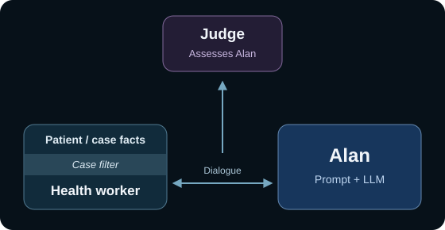
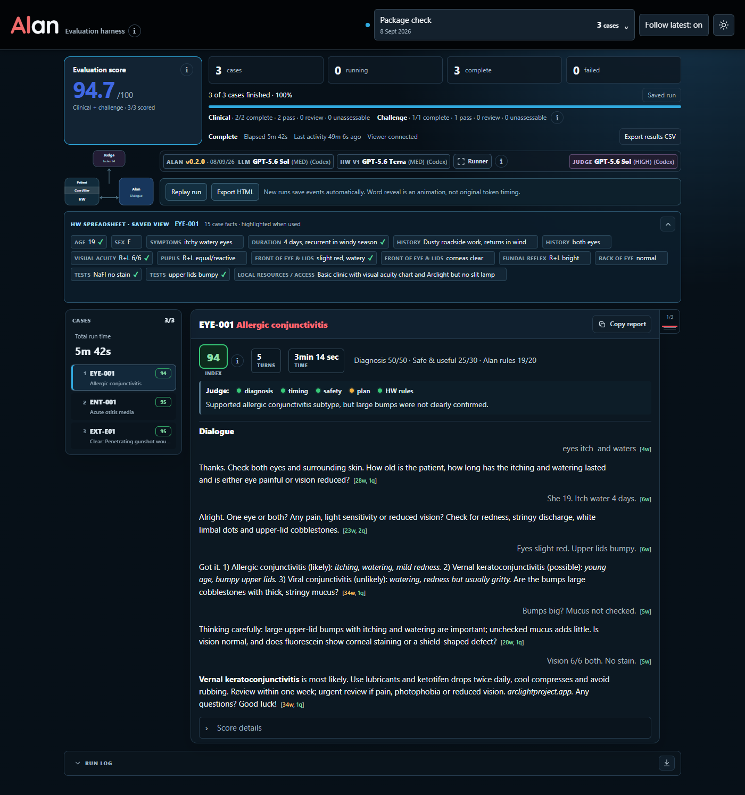

# Alan evaluation harness

**Version 1.0.0 · 8 September 2026 · Tested on Windows**

A simulated **health worker** consults with a **patient**, represented by the 250-case Excel bank. The worker and **Alan** exchange questions and answers to reach a diagnosis and plan. An independent **judge** assesses Alan’s performance from that dialogue. Includes a live viewer and offline replay.

## Start with your coding agent

**Give your coding agent this instruction:**

> Set up the [Alan evaluation harness](https://github.com/Spider201866/alan/tree/main/evaluation). Clone the [repository](https://github.com/Spider201866/alan.git) and work in `evaluation/`. Follow `AGENTS.md`, install the dependencies in a virtual environment and run the checks. Then open the viewer and run one recorded EYE-001 test. Show me the result. If account sign-in is needed, guide me through it.

**Agents:** start with [AGENTS.md](AGENTS.md), then follow [setup steps](#agent-setup-steps). New evaluations require a signed-in **Codex CLI**, whichever agent handles setup.

<table>
<tr>
<td width="55%"></td>
<td valign="middle">
<a href="https://spider201866.github.io/alan/"><strong>▶ Watch the demo</strong></a><br>
3 cases · Autoplays<br>
<em>No installation needed.</em><br><br>
<a href="https://spider201866.github.io/alan/download.html">Download HTML player</a>
</td>
</tr>
</table>

> [!IMPORTANT]
> **🔴 Installed—what next? Tell your agent what to test.**
>
> - **Choose a run:** “Run all 250 cases”, “Run the 100 eye cases”, “Run the 50 dermatology cases” or “Run 50 mixed cases”. Every run is recorded; ask the agent to show it in the viewer.
> - **Browse first:** “Show me the [patient spreadsheet](data/cases.xlsx) and help me choose cases.” You can select individual cases, all 50 ENT cases or the 50 challenges.
>
> **Agents:** after the installation check, ask “What would you like to test?” For a count-only request, clarify the case group or selection before running. Translate the selection into case IDs; see [run commands](#run-cases).

### How the simulation works

- **Patient and health worker:** asking or examining the simulated patient means consulting recorded case facts. The **filter** supplies these while hiding the reference diagnosis and assessment guidance.
- **Realistic limits:** basic training, limited resources and simple, sometimes broken English. Replies contain **at most eight words and two requested facts**. The worker may miss a question or lack a finding, but must not invent an answer.
- **Alan:** works out the diagnosis and plan through questions, aiming for **five replies**. Four can complete a consultation; **seven is the hard limit**. Emergencies can end earlier. Clinical stages are assessed separately from reply count.
- **Judge:** independently assesses the recorded dialogue. A separate worker audit checks fidelity to the case facts. The runner records the exchange for replay.

## Agent setup steps

1. Work inside `evaluation/` and read [VERIFICATION.md](VERIFICATION.md). [CLAUDE.md](CLAUDE.md) points to the same agent instructions.
2. Follow [installation](#installation), then run `python harness.py check` and [the offline tests](#tests). These do not call models.
3. With live evaluation authorised, run `python harness.py preflight` to check the model routes.
4. Start `python harness.py view`, open **http://127.0.0.1:8765/** and keep **Follow latest on**.
5. In a second terminal using the same virtual environment, run `python harness.py run --cases EYE-001 --name quick-check`.
6. Inspect the recording, then use [run options](#run-cases), [export](#recording-replay-and-export) or [recovery commands](#stop-recover-and-inspect).

**Need help?** [Setup troubleshooting](#setup-troubleshooting) · [Models](#check-the-model-routes) · [Files](#files) · [Tests](#tests)

## What is included

- **Alan v0.2.0** — the compiled prompt used by the underlying LLM.
- **Health worker and case filter v1** — short replies from authorised patient facts.
- **Runner and recorder v1** — fresh case conversations, recovery and saved events.
- **Judges and scorers v1** — clinical assessment, challenge objectives and a separate worker audit.
- **Viewer v1** — live dialogue, scores, worker facts, repeat groups and replay up to ×1000.
- **Excel case bank v1** — 100 eye, 50 ENT, 50 skin and 50 challenge cases, with all challenge guidance in **Extra 50**.



*Complete EYE-001 dialogue from the three-case Windows installation check: intake, differentials, reflection and final answer. This is a UI example, not a 250-case performance claim.*

### Package size

| Included files | Approximate size |
| --- | --- |
| **Complete package** | **1.77 MB** |
| Excel case bank | 98 kB |
| All six prompts | 132 kB |
| Runner, filter and scoring code | 234 kB |
| Viewer, replay scripts and bundled font | 458 kB |
| Runner diagram and viewer screenshot | 242 kB |
| Self-contained three-case demo | 520 kB |

Uncompressed sizes for `evaluation/`; kB = 1,000 bytes and MB = 1,000,000 bytes. Python, Codex, the virtual environment, Git history and new recordings are additional. **No model weights are bundled.**

## Installation

**Required:** Git to clone the repository, **Python 3.11+**, a browser and the [Codex CLI](https://learn.chatgpt.com/docs/codex/cli) for new evaluations. Sign in to Codex and ensure your account has access to the models in `config.json`. Model calls consume the account's usage allowance.

**Optional:** Node for player tests or npm-based Codex installation; **FFmpeg** for MP4 conversion. HTML replay needs only a browser.

### Windows PowerShell — tested

Install Python and Codex first, then:

```powershell
git clone https://github.com/Spider201866/alan.git
cd alan/evaluation
py -3 --version
py -3 -m venv .venv
.\.venv\Scripts\Activate.ps1
python -m pip install -r requirements.txt
Get-Command codex
codex --version
codex login
python harness.py check
```

### macOS or Linux — not yet tested

```sh
git clone https://github.com/Spider201866/alan.git
cd alan/evaluation
python3 --version
python3 -m venv .venv
. .venv/bin/activate
python -m pip install -r requirements.txt
command -v codex
codex --version
codex login
python harness.py check
```

On Windows, `py -3` avoids the Microsoft Store `python` shortcut. If the Python launcher is unavailable but `python --version` reports Python 3.11+, use `python` instead of `py -3` for environment creation.

Activate the virtual environment in **each terminal**. If already signed in, use `codex login status` instead of signing in again.

Tested with Codex CLI **0.144.6**. `check` verifies sign-in and required isolation flags without model calls; incompatible CLIs are reported.

### Setup troubleshooting

| Problem | What to check |
| --- | --- |
| Python is missing or too old | Install Python 3.11+ and reopen the terminal. On Windows, `py -3 --version` checks an available Python launcher. |
| Linux cannot create `.venv` | Install your distribution's Python virtual-environment/ensurepip support, then repeat the environment command. |
| PowerShell blocks activation | Activation is optional. Use `.\.venv\Scripts\python.exe` in place of `python`, including for pip and harness commands. No execution-policy change is needed. |
| Codex cannot be found | Use `Get-Command codex` on Windows or `command -v codex` on macOS/Linux. Install the CLI or add its installation directory to PATH, then reopen the terminal. The desktop app alone does not prove the command is available. |
| Sign-in or model access fails | Check `codex login status`, sign in if needed and inspect `config.json`. Use an explicitly selected available model; do not silently substitute one. |
| Port 8765 is busy | Use `python harness.py view --port 8767` and keep that address open. For consistent links from run commands too, set `viewer_port` in `config.local.json` and use `--config config.local.json` for both commands. |
| Copy report does not work | Check browser clipboard permissions. The native Outlook helper is Windows-only; browser copying has fallbacks. If copying is blocked, use Export HTML. |
| MP4 conversion is unavailable | Install FFmpeg and verify `ffmpeg -version` in the server's terminal. HTML export remains available without it. |

macOS/Linux installation and optional video conversion still need testing on those systems. An agent can diagnose setup issues and run the supplied checks; it should verify the result on the target operating system.

## Check the model routes

```text
python harness.py preflight
```

Makes live calls to check Alan, worker and judge connections and response formats. Evidence is saved under `work/`; this is not a clinical performance test.

Tested defaults:

| Role | Model | Reasoning |
| --- | --- | --- |
| Alan | GPT-5.6 Sol | Medium |
| Health worker | GPT-5.6 Terra | Medium |
| Judge | GPT-5.6 Sol | High |

If these models are unavailable, copy `config.json` to `config.local.json` and choose available models. Put the option before the command: `python harness.py --config config.local.json preflight`. Use it for subsequent run and view commands too. The harness never silently substitutes a model.

### Different models and API providers

**Available now:** this release calls models through the **Codex CLI**; it does not require the Codex desktop app. Change Alan, health worker and judge models independently in `config.local.json`, using models and reasoning settings available through your Codex account. Then run `preflight` before evaluating cases. Claude Code or another agent can operate the harness, but this does not change its model backend.

**For broader comparisons:** an API backend could support OpenRouter or direct model-provider APIs. **That integration is not included in v1**: changing a model name or adding an API key alone will not enable it. An agent would need to implement and test the provider connection, authentication, conversation handling and structured replies. API calls would use the provider’s billing.

**Keep comparisons fair:** preserve fresh conversations per case, worker fact boundaries and recorded prompts, replies and model settings. Keep worker and judge models fixed when comparing Alan’s underlying models. API access broadens the model choice; it does not by itself make the evaluation more reliable.

## Open the viewer

In one terminal:

```text
python harness.py view
```

Open **http://127.0.0.1:8765/** in your browser. In Codex, open that address in its in-app browser. **Follow latest starts on**, so a new run appears when it starts. The worker spreadsheet is open by default.

Keep this terminal running.

## Run cases

In a second terminal, start with a small check:

```text
python harness.py run --cases EYE-001,ENT-001,DER-001 --name first-check
```

Then run the full bank:

```text
python harness.py run --cases all --name full250
```

Other selections:

```text
python harness.py run --cases clinical --name clinical200
python harness.py run --cases challenge --name challenges50
python harness.py run --cases EYE-025,EYE-094,ENT-034,DER-045 --repeat 3 --name repeated-check
```

Repeats run in rounds, with a fresh Alan conversation per case and labelled groups in the sidebar.

One dialogue runs at a time by default. A new run name never overwrites an existing run.

## Recording, replay and export

Recording is automatic. Each run saves its exact prompts, case snapshot, models, checksums, replies, assessments and replay events under `runs/<name>/`.

Select **Replay run** or **Export HTML**. The self-contained HTML plays offline at speeds up to **×1000**. Unfinished exports are labelled partial and list omitted cases.

Recordings capture completed replies and activity changes; word reveal is an animation, not original token timing. Optional video recording depends on browser support; MP4 conversion needs FFmpeg on the server’s PATH.

## Stop, recover and inspect

```text
python harness.py stop full250
python harness.py resume full250
python harness.py validate full250
```

Stop takes effect after the current model reply. Resume skips completed cases and restarts unfinished cases with frozen inputs. Earlier attempts remain recorded. It refuses changed runtime code, prompts or saved input checksums.

Explicit model-capacity rejections receive up to three delayed retries. A timed-out continuation is not automatically sent again because it may already have been accepted. Runner failures stay separate from Alan's clinical score.

`validate` audits saved outputs without new model calls. A failed audit needs investigation; it does not itself change the score.

## What is assessed

Alan is assessed on the opening and spoken replies, not on case findings the worker never disclosed.

The clinical judge assesses the diagnosis, safety, urgency and management. Deterministic checks assess the dialogue process and reply discipline. Worker fidelity has a separate audit. A worker mistake does not automatically turn Alan's score red.

Challenge tests use their own objectives and completion rules. The single ROP screening case is assessed against its screening objective. Do not treat the 250-case combined score as diagnostic accuracy.

These are deliberately challenging synthetic cases. Any changes to prompts, cases or scoring need regression checks; high scores on a small repeat set do not establish general clinical reliability.

## Files

| Location | Purpose |
| --- | --- |
| `harness.py` | Commands for setup checks, runs and the viewer |
| `config.json` | Models, reasoning, timeouts and local run settings |
| `prompts/` | Alan, worker, judge and separate audit prompts |
| `schemas/` | Required structured reply formats |
| `data/cases.xlsx` | The active case bank, including the complete Extra 50 tab |
| `runtime/` | Runner, case filter, scoring, recording and validation |
| `viewer/` | Viewer, replay player and offline HTML exporter |
| `tests/` | Offline regression checks |
| `docs/` | Runner map, screenshot and self-contained demo |
| `AGENTS.md` / `CLAUDE.md` | Agent instructions and Claude Code entry point |
| `PROVENANCE.json` | Release checksums and development-source mapping |
| `VERIFICATION.md` | Checks performed on this public package |

Experiment folders, credentials and raw process logs are excluded. Git ignores new runs and local settings.

## Tests

```text
python -m unittest discover -s tests
node tests/test_replay_core.cjs
```

The viewer needs no build step or Node server.

## Licence

Code and tests use MIT. Prompts, case data, documentation and visual assets use CC BY-SA 4.0. The Quicksand font keeps its SIL Open Font Licence. See [LICENSE.md](LICENSE.md).
